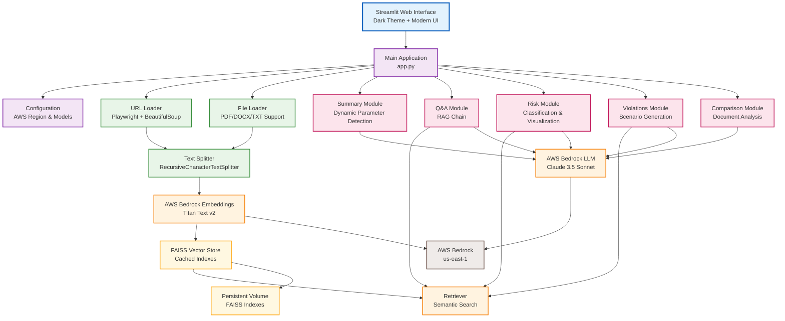
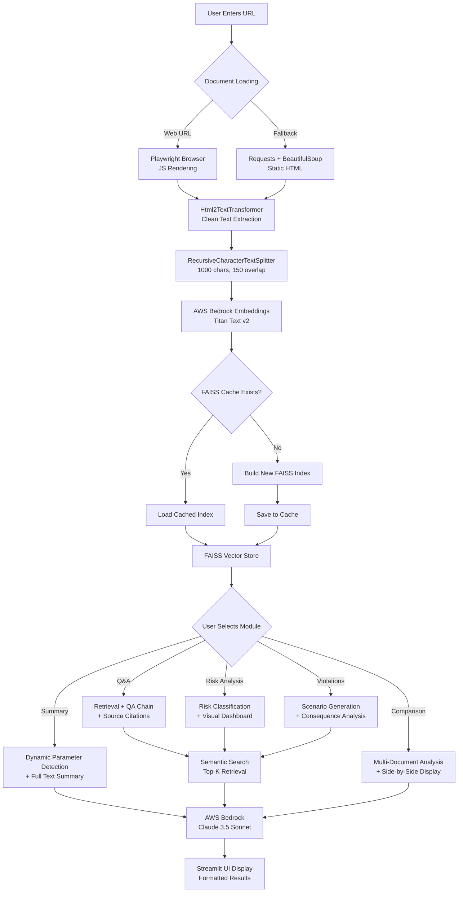
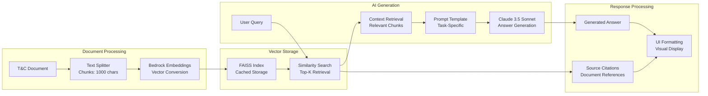

# Terms & Conditions Analyzer 📘

**An AI-powered legal document analysis tool that transforms complex Terms & Conditions into user-friendly insights using RAG (Retrieval-Augmented Generation) and AWS Bedrock.**

## Overview

The Terms & Conditions Analyzer is an intelligent document processing system that helps users understand complex legal documents through natural language interaction. It combines document processing, vector search, and AI analysis to provide summaries, answer questions, identify risks, and generate comparison reports.

## Key Features

- **🌐 Web Document Loading**: Extract T&C content from URLs with JavaScript rendering support
- **📝 Smart Summarization**: AI-powered detection of key sections and automatic summarization
- **💬 Interactive Q&A**: Natural language questions with context-aware answers
- **⚠️ Risk Assessment**: Automated risk level classification with visual dashboards
- **🚨 Violation Scenarios**: Generate hypothetical policy violation scenarios
- **🔀 Document Comparison**: Side-by-side analysis of different T&C documents
- **🎨 Modern UI**: Dark-themed Streamlit interface with responsive design

## Architecture

### High-Level System Architecture



### Detailed Data Flow Architecture



### RAG (Retrieval-Augmented Generation) Pipeline



## Core Components Deep Dive

### 🔧 Document Processing Pipeline

#### **URL Loader (`loaders/url_loader.py`)**
- **Primary Method**: Playwright with JavaScript rendering for dynamic content
- **Fallback Method**: Requests + BeautifulSoup for static HTML
- **Text Extraction**: Html2TextTransformer for clean text conversion
- **Error Handling**: Graceful fallbacks with detailed logging

#### **Text Splitter**
- **Algorithm**: RecursiveCharacterTextSplitter
- **Chunk Size**: 1000 characters with 150 character overlap
- **Purpose**: Optimal balance between context preservation and retrieval precision

### 🤖 AI Integration Layer

#### **AWS Bedrock Integration**
```python
# Embedding Model
embeddings = BedrockEmbeddings(
    model_id="amazon.titan-embed-text-v2:0",
    region_name="us-east-1"
)

# LLM Model
llm = ChatBedrock(
    model_id="anthropic.claude-3-5-sonnet-20240620-v1:0",
    region_name="us-east-1"
)
```

#### **LangChain Framework**
- **ChatBedrock**: AWS Bedrock integration wrapper
- **PromptTemplate**: Task-specific prompt engineering
- **RetrievalQA**: RAG chain orchestration
- **Document Processing**: Automated chunking and metadata management

### 🗄️ Vector Storage System

#### **FAISS Vector Database**
- **Caching Strategy**: MD5 hash-based cache keys from source URLs
- **Storage Location**: `/app/faiss_indexes` (persistent volume in K8s)
- **Performance**: In-memory vector similarity search
- **Scalability**: CPU-optimized FAISS implementation

### 📋 Processing Modules

#### **1. Summary Module (`modules/summary_module.py`)**
**Dynamic Parameter Detection:**
- AI analyzes document to identify key sections
- Returns prioritized list of important parameters
- Generates focused summaries based on detected parameters

#### **2. Q&A Module (`modules/qa_module.py`)**
**RAG-Powered Question Answering:**
- Semantic search for relevant document chunks
- Context-aware answer generation
- Source citation with clickable references
- Legal jargon simplification

#### **3. Risk Module (`modules/risk_module.py`)**
**Risk Classification System:**
- **High Risk**: Account termination, liability limitations, binding arbitration
- **Medium Risk**: Fee structures, data sharing policies
- **Low Risk**: General usage guidelines, contact information
- **Visualization**: Pie charts and color-coded tables

#### **4. Violations Module (`modules/violations_module.py`)**
**Scenario Generation:**
- AI generates realistic violation scenarios
- Maps violations to specific policy sections
- Predicts potential consequences
- Exportable CSV format

#### **5. Comparison Module (`modules/comparison_module.py`)**
**Multi-Document Analysis:**
- Dynamic parameter detection for both documents
- Side-by-side policy comparison
- Structured JSON output parsing
- Expandable comparison sections

## Technology Stack

### **Core Framework**
- **Python 3.x**: Primary programming language
- **Streamlit**: Modern web application framework
- **LangChain**: LLM application orchestration

### **AI & Machine Learning**
- **AWS Bedrock**: Cloud-based AI platform
- **Anthropic Claude 3.5 Sonnet**: Advanced language model
- **Amazon Titan Embed Text v2**: High-quality text embeddings

### **Document Processing**
- **Playwright**: JavaScript-capable web scraping
- **BeautifulSoup4**: HTML parsing and extraction
- **PyPDF**: PDF document processing
- **Html2TextTransformer**: Clean text conversion

### **Vector Database**
- **FAISS (CPU)**: High-performance similarity search
- **Persistent Storage**: Kubernetes volume integration
- **Caching Strategy**: Hash-based index management

### **Visualization & UI**
- **Matplotlib**: Risk analysis charts and graphs
- **Custom CSS**: Dark theme with modern styling
- **Responsive Design**: Mobile-friendly interface

## Kubernetes Deployment Architecture

### **Container Strategy**
```yaml
# Resource Configuration
resources:
  requests:
    memory: "1Gi"
    cpu: "500m"
  limits:
    memory: "2Gi"
    cpu: "1"
```

### **Storage Architecture**
- **PersistentVolume**: 5Gi local storage for FAISS indexes
- **VolumeMount**: `/app/faiss_indexes` for cache persistence
- **StorageClass**: Manual provisioning for development

### **Configuration Management**
- **ConfigMap**: Environment variables and model configuration
- **Secrets**: AWS credentials with base64 encoding
- **Health Checks**: Streamlit health endpoints for liveness/readiness

### **Service Architecture**
- **NodePort Service**: External access on port 30501
- **Session Affinity**: ClientIP for FAISS cache consistency
- **Load Balancing**: Single replica with horizontal scaling capability

## Advanced Features

### **Smart Caching System**
```python
@st.cache_resource
def get_vector_store(docs, embeddings, source):
    store_hash = hashlib.md5(source.encode()).hexdigest()[:8]
    # Cache vector stores by source URL hash
```

### **Error Handling & Resilience**
- **Graceful Fallbacks**: Multiple document loading strategies
- **Input Validation**: URL format checking and sanitization
- **Progress Indicators**: Real-time feedback for long operations
- **Resource Management**: Memory-efficient document processing

### **Performance Optimizations**
- **Streamlit Caching**: Function-level caching for expensive operations
- **Vector Index Persistence**: Avoid re-embedding on application restart
- **Chunk Size Optimization**: Balance between context and retrieval accuracy
- **Lazy Loading**: On-demand module initialization

## Usage Workflow

### **1. Document Loading**
1. User enters Terms & Conditions URL
2. System attempts Playwright rendering for dynamic content
3. Falls back to static HTML parsing if needed
4. Extracts and cleans text using Html2TextTransformer

### **2. Vector Processing**
1. Text chunked into 1000-character segments with overlap
2. Chunks converted to embeddings using Titan Text v2
3. FAISS index created and cached for future use
4. Retriever configured for semantic search

### **3. Analysis Modules**
1. **Summary**: AI detects key parameters and generates overview
2. **Q&A**: User queries answered with retrieved context
3. **Risk Assessment**: Clauses classified and visualized
4. **Violations**: Hypothetical scenarios generated
5. **Comparison**: Multi-document analysis with structured output

## Configuration & Customization

### **Model Configuration (`config.py`)**
```python
AWS_REGION = "us-east-1"
EMBED_MODEL = "amazon.titan-embed-text-v2:0"
LLM_MODEL = "anthropic.claude-3-5-sonnet-20240620-v1:0"
```

### **Prompt Engineering**
- **Task-Specific Templates**: Optimized prompts for each analysis type
- **Context Management**: Efficient use of Claude's context window
- **Output Formatting**: Structured JSON and markdown responses

### **UI Customization**
- **Dark Theme**: Professional appearance with cyan accents
- **Responsive Design**: Optimized for desktop and mobile
- **Interactive Elements**: Expandable sections and progress indicators

## Installation & Deployment

### **Local Development**
```bash
# Install dependencies
pip install -r requirements.txt

# Configure AWS credentials
export AWS_ACCESS_KEY_ID=your-key
export AWS_SECRET_ACCESS_KEY=your-secret

# Run application
streamlit run app.py
```

### **Kubernetes Deployment**
```bash
# Create namespace
kubectl create namespace tc-analyzer

# Deploy all components
kubectl apply -f k8s/

# Access application
http://<node-ip>:30501
```

### **Docker Container**
```bash
# Build image
docker build -t tc-analyzer:latest .

# Run container
docker run -p 8501:8501 \
  -e AWS_ACCESS_KEY_ID=your-key \
  -e AWS_SECRET_ACCESS_KEY=your-secret \
  tc-analyzer:latest
```

## Security & Compliance

### **Data Privacy**
- **No Document Storage**: Documents processed in memory only
- **Temporary Caching**: FAISS indexes cached locally, not shared
- **AWS Integration**: Secure credential management via Kubernetes secrets

### **Access Control**
- **Network Security**: NodePort service with configurable access
- **Resource Limits**: Container resource constraints
- **Health Monitoring**: Automated health checks and restart policies

## Future Enhancements

### **Planned Features**
- **Multi-language Support**: Document analysis in different languages
- **Batch Processing**: Multiple document analysis in parallel
- **Export Capabilities**: PDF reports and detailed analysis exports
- **Advanced Visualizations**: Interactive charts and comparison matrices

### **Integration Opportunities**
- **Legal Database Integration**: Cross-reference with legal precedents
- **Contract Management Systems**: Integration with enterprise tools
- **Compliance Frameworks**: GDPR, CCPA, and other regulatory mapping
- **API Development**: RESTful API for programmatic access

## Contributing

The Terms & Conditions Analyzer is designed with modularity in mind. Key areas for contribution:

- **New Analysis Modules**: Additional document analysis capabilities
- **Enhanced UI Components**: Improved visualization and interaction
- **Performance Optimizations**: Caching strategies and processing efficiency
- **Language Model Integration**: Support for additional AI providers
- **Document Format Support**: Extended file type compatibility


